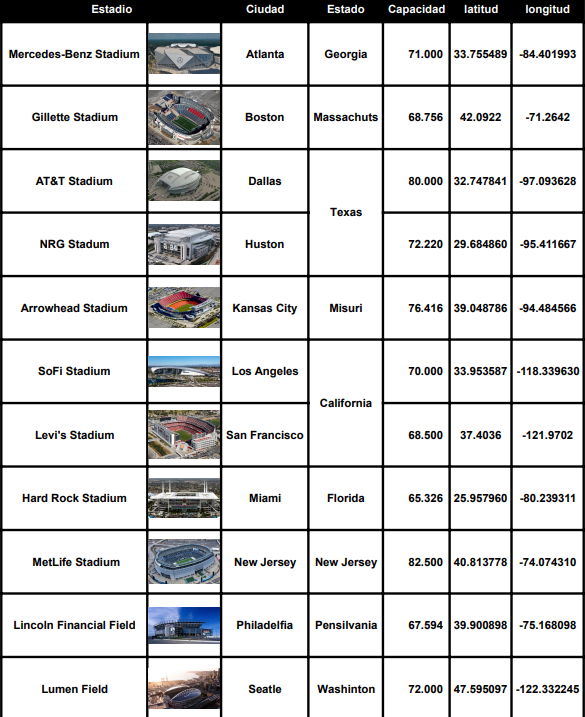

# <h1 align="center">**`Proyecto Google-Yelp(Hoteles)`**</h1>

  

## **Descripción del proyecto**

El propósito es evaluar y comparar las puntuaciones obtenidas tanto en base de datos de [google maps](https://drive.google.com/drive/folders/1Wf7YkxA0aHI3GpoHc9Nh8_scf5BbD4DA) como en [Yelp](https://drive.google.com/drive/folders/1TI-SsMnZsNP6t930olEEWbBQdo_yuIZF), con el fin de identificar las ubicaciones más propicias para el éxito y el crecimiento sostenido de los negocios. Este análisis permitirá a los inversionistas tomar decisiones informadas sobre dónde emplazar sus negocios para maximizar el potencial de retorno de la inversión.

## **Alcance del proyecto**
Con el objetivo de cumplir con el propósito establecido y teniendo en cuenta la proximidad del próximo Mundial de Fútbol programado para el año 2026, del cual Estados Unidos será uno de los anfitriones, hemos decidido enfocarnos específicamente en los hospedajes y hoteles ubicados en las cercanías de los estadios. Esta elección se debe a que estos lugares no solo serán relevantes durante el Mundial, sino que también son y continuarán siendo escenarios de numerosos eventos y deportes, como el Fútbol Americano, que atraen a una gran cantidad de turistas anualmente.

Además, estos estadios están estratégicamente situados en ciudades importantes y prósperas de todo el país. Dada su relevancia, no solo durante el Mundial sino a lo largo del tiempo, nos centraremos en proporcionar una evaluación detallada de los hospedajes en un rango cercano a estos estadios.

Los 10 estadios designados para el próximo Mundial 2026 en Estados Unidos son:

  

  

En este sentido, el alcance del proyecto está dado en los siguientes parámetros:
+ Lugares objetivo: los 10 estadios donde se jugarán los partidos del mundial.
+ Ciudades objetivo: 10 ciudades donde están ubicados los estadios respectivos.
+ Sitios de interés para el análisis: todos los puntos referenciados en la metadata de Google y Yelp con ubicación geográfica ‘latitude’ y ‘longitude’ con distancia menor a 30 kilómetros alrededor del estadio respectivo, y se agregarán algunas zonas de interés turístico de acuerdo a la ciudad.

## **Stack Tecnológico**
Las herramientas que se usaron para este proyecto son:

+ **Python:** Utilizado para el procesamiento y análisis de datos
+ **Pandas y Numpy:** Librerías para el manejo tabular de datos.
+ **Matplotlib y Seaborn:** Herramientas para visualización y análisis exploratorio de datos.
+ **NLTK (Natural Language Toolkit):** Librería para procesamiento de lenguaje natural, incluyendo análisis de sentimiento a las reseñas hechas por los usuarios de ambas plataformas.
+ **boto3:** Librería para interactuar con servicios de AWS como Amazon S3.
+ **Docker:** Sistema para gestionar contenedores, simplificando la manipulación de datos.
+ **Amazon S3 AWS:** Almacenamiento escalable y duradero para datos a través de internet.
+ **GitHub:** Plataforma de control de versiones para colaboración en equipo.
+ **Google Cloud Storage:** Ideal para datasets escalables y optimizados en la nube.
+ **Google Drive:** Utilizado para sincronización y acceso a archivos desde cualquier lugar.
+ **Looker Studio:** Es una herramienta utilizada para la visualización de datos a través de paneles o informes.
+ **Streamlit:** Modelo de Machine Learning

  

Con el siguiente grafico podemos observar como queda establecido el ciclo de vida del dato:

  

## **Los KPI**
Los KPI(Indicador clave de rendimiento) establecidos para este proyecto son 4:

  

## **Division de las etapas del proyecto**
El proyecto se divide en tres Sprint:

+ **Sprint 1:** Se enfoca en el análisis inicial y la propuesta de cómo abordar el proyecto, estableciendo un entendimiento claro de la situación y objetivos.

+ **Sprint 2:** Se trabaja en la infraestructura del proyecto con un enfoque en ETL, preparando el terreno para análisis y visualizaciones de datos.

+ **Sprint 3:** Culmina con el desarrollo de Dashboard interactivos y modelos de ML, integrando análisis y datos procesados para proporcionar insights valiosos.

En cada sprint, la iteración, la colaboración y la flexibilidad son fundamentales, guiando al equipo hacia la entrega de soluciones innovadoras de data.

## **Coordinación de las tareas**
El equipo esta organizado por un diagrama de GANTT en la aplicación web de **'Jira'**

  

## **Equipos de trabajo y Roles**
**Data Engineers (Ingenieros de Datos):**

+ María Gabriela Pacheco Franco

+ Patricio Martinez Cintas

"Los Data Engineers son los arquitectos detrás de la infraestructura de datos. Su tarea principal es diseñar y mantener sistemas eficientes para la recopilación, almacenamiento y procesamiento de datos.
Construir los Data Pipeline para extraer, transformar y cargar (ETL) la  información de Yelp y Google Maps.
Garantizar que los datos estén limpios, disponibles y listos para su análisis por parte de los Data Scientists y el Data Analyst."

**Data Scientists (Científicos de Datos):**

+ Hector Fabio Ocampo Gaviria

+ Luis Mary Esmeralda Gaince Pereira

"Los Data Scientists son los responsables del análisis.  Su tarea principal es utilizar técnicas avanzadas de aprendizaje automático y análisis de sentimientos para extraer información valiosa de las reseñas de usuarios.
Identificar patrones, tendencias y oportunidades de crecimiento en los rubros de negocios relacionados con la hotelería y el turismo.
Su trabajo ayudará a predecir qué sectores experimentarán un crecimiento significativo y cuáles podrían decaer."

**Data Analyst (Analista de Datos):**

+ Facundo José Cuerdo

"El Data Analyst será el narrador de la historia detrás de los datos. Su tarea principal es analizar las opiniones de los usuarios y crear visualizaciones claras y concisas.
Utilizar análisis de sentimientos para comprender las experiencias de los usuarios en Yelp y Google Maps.
Además, desarrollar un sistema de recomendación de hospedaje y alojamiento basado en las preferencias y experiencias previas de los usuarios."

## **Pasos de realizacion del proyecto**

### **1-EDA(Exploratory Data Analysis) preliminar de los datos:**
En esta etapa se realizo un primer EDA premiminar para destacar información importante sobre ambas bases de datos. Podemos destacar la busqueda de:

+ Existencia de valores atípicos, datos faltantes o inconsistencias.

+ Existencia de duplicados o registros repetidos.

+ Cálculos de las estadísticas básicas, como la media, la mediana y la desviación estándar para comprender la distribución de los datos.

+ Existencia valores máximos y mínimos para detectar posibles errores y valores extremos.

+ Tipo de datos de las variables de cada columna

**En este proyecto el EDA se encuentran en 4 archivos:**

**Dataset Google:**
* [Preparacion dataset google](/EDA/Preparacion%20dataset%20google.ipynb)
* [EDA google](EDA/EDA%20google.ipynb)

**Dataset Yelp:**
* [Preparacion dataset yelp](/EDA/Preparacion%20dataset%20yelp.ipynb)
* [EDA Yelp](/EDA/EDA%20Yelp.ipynb)

